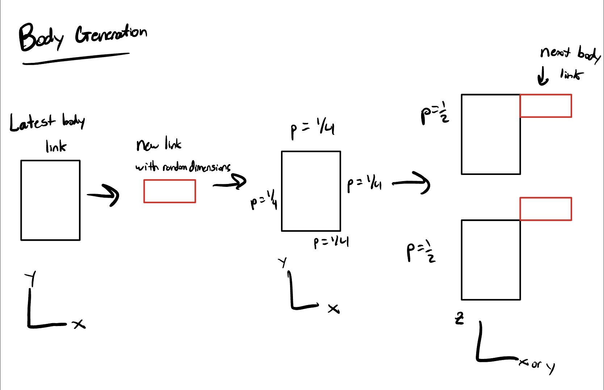
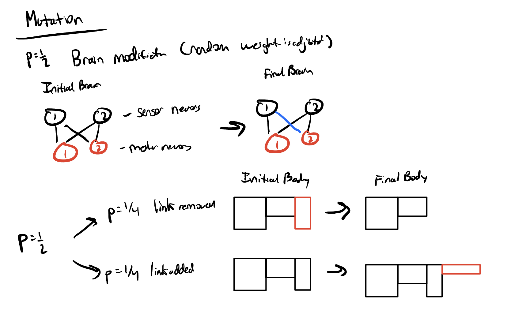
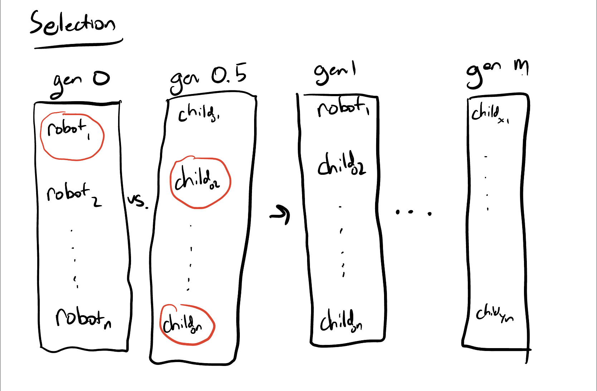

# Final Project: Does Size Matter?
Max Paik's Repo for the Final Project for CS 396 Artificial Life at Northwestern University Winter 2023

# Usage

run "python search.py"

# What This Is and How It Works

This codebase showcases an experiment involving evolved robots. 
In particular, the goal of this codebase is to explore how the size of individual body parts affects the effectiveness of evolution for locomotion. 
The fitness function rewards robots that travel the furthest in a given direction during the time of the simulation.
Over time, random mutations occur and more fit robots are selected for. 
Robots are generated randomly and evolution occurs both through modification of the body plan and the weights within the robot's brain.
See below sections for more details on brain/body generation, mutation, and selection.

# Brain and Body Generation

The first step of body generation is to set an initial number of links in the body. 
After that, my algorithm builds up a body one link at a time. 
At each step, first a rectangular prism link is generated with random dimensions where each dimension is between 0 and .5 in length.
Then, the new link must be appended to the existing body (the first link is just placed in the center of the world).
This is done by choosing a direction. There is a one quarter chance that the next block is placed in the +x, -x, +y, or -y directions.
There is then a fifty-fifty chance that the block is placed either above the last link or at the same height as the last link.
Using numpy's random generators, a joint is placed to connect the last block with the new link.
Because each link is placed according to these probabilities, my robots are capable of growing in a near limitless number of truly three dimensional configurations.
One edge case I addressed is to avoid placing two joints in the same spot. 
I avoid this by disallowing child links from being placed at the same side as a parent link. 
If the randomly generated orientation would result in this I simply generate a new random orientation.

This process is represented in the following diagram: 

EXPLANATION OF DIRECT ENCODING/STORAGE

The brain is generated by first flipping a biased coin to decide if each body link is given a sensor (80 percent chance of a given link having a sensor). 
Each link with a sensor gets a corresponding sensor neuron and each joint a corresponding motor neuron.
Then, the brain is made to be fully connected, meaning every sensor neuron connects to every motor neuron.
Initially, the weights are given random values between -1 and 1.

There are a few constraints. First, my robots grow upwards but not downwards. 
In addition, all joints rotate about the either the x or y axis.
I believe these simplifications were necessary because of the otherwise truly random nature of my body generation algorithm, which needed some constraints to produce reasonable robots.

# Brain and Body Mutation

At each evolutionary step, first a fair coin is flipped which decides if the brain or body will be modified in this iteration.

If the brain is chosen to be modified, a given weight is updated to have a randomly generated new value between -1 and 1.

On the other hand, there are two branches of body mutation, each of which have equal odds of occuring if the body is to be modified.
First, the last link in the body may simply be popped off.
Alternatively, a new link may be generated and placed at the end of the robot using the same algorithm as the original body generation.

# Selection

I use the parallel hill climber 

# Experimental Setup

I consider three different groups of robots: Group A, Group B, and Group C. 
Each group consists of robots generated according to the above algorithm. 
The defining characteristic of these three groups is the maximum size of each link. 

DIAGRAM OF IDENTICAL ROBOTS OF THREE GROUPS

# Hypothesis

My hypothesis is that 

# Results

BRIEF BLURB

---
|Group|A|B|C|
|Maximum Link Size|X|X|X|
|Maximum Fitness|X|X|X|
|Average Fitness|X|X|X|
|Uncertainty|X|X|X|
---

TABLE OF RESULTS
PLOT HERE OF FITNESS CURVES
LINK TO VIDEO 

# Credit

This work is based off r/ludobots and makes extensive use of the Pyrosim library.