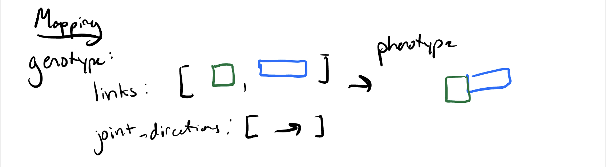
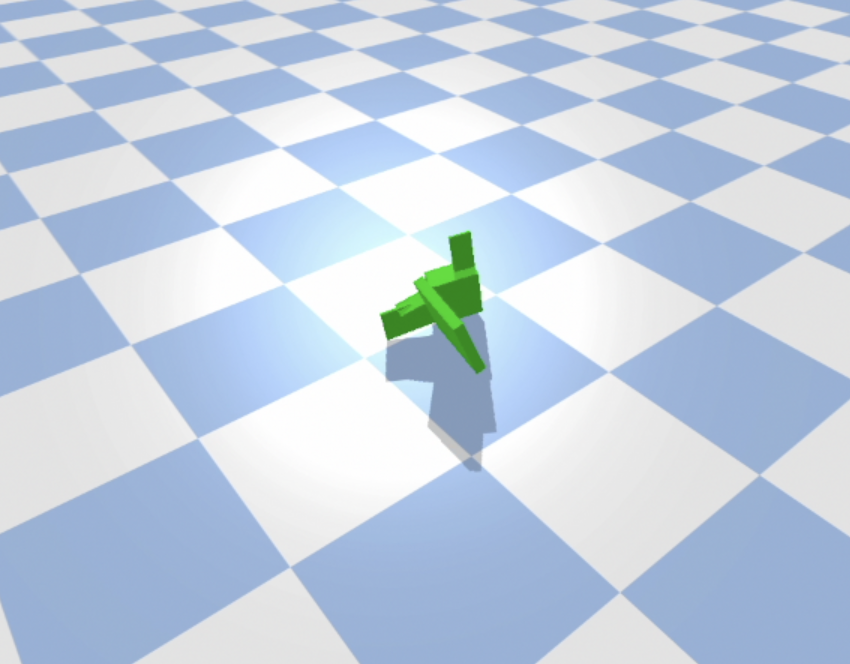
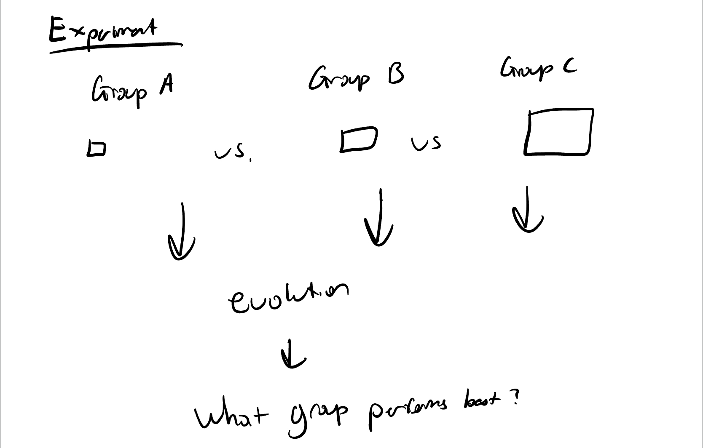
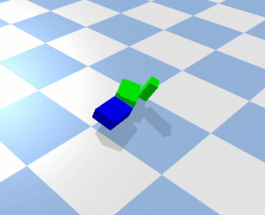
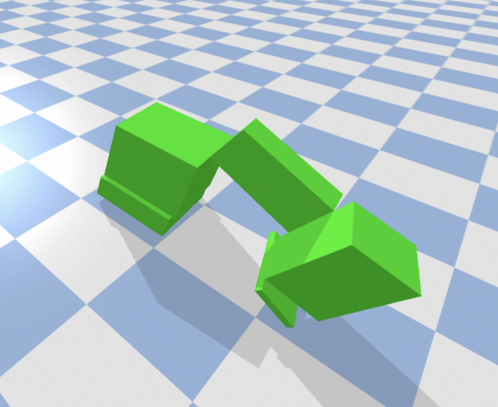
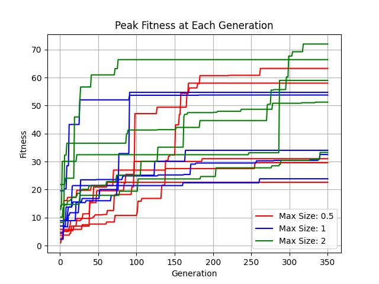

# Final Project: Does Size Matter?
Max Paik's Repo for the Final Project for CS 396 Artificial Life at Northwestern University Winter 2023

# Usage

run "python search.py"

# What This Is and How It Works

This codebase showcases an experiment involving evolved robots. 
In particular, the goal of this codebase is to explore how the size of individual body parts affects the effectiveness of evolution for locomotion. 
The fitness function rewards robots that travel the furthest in a given direction during the time of the simulation.
Over time, random mutations occur and more fit robots are selected for. 
Robots are generated randomly and evolution occurs both through modification of the body plan and the weights within the robot's brain.
See below sections for more details on brain/body generation, mutation, and selection.

For a brief ten second teaser, visit the following [link](https://youtu.be/kYGm00_MJoo) 

# Brain and Body Generation

The first step of body generation is to set an initial number of links in the body. 
After that, my algorithm builds up a body one link at a time. 
At each step, first a rectangular prism link is generated with random dimensions where each dimension is between 0 and .5 in length.
Then, the new link must be appended to the existing body (the first link is just placed in the center of the world).
This is done by choosing a direction. There is a one quarter chance that the next block is placed in the +x, -x, +y, or -y directions.
There is then a fifty-fifty chance that the block is placed either above the last link or at the same height as the last link.
Using numpy's random generators, a joint is placed to connect the last block with the new link.
Because each link is placed according to these probabilities, my robots are capable of growing in a near limitless number of truly three dimensional configurations.
One edge case I addressed is to avoid placing two joints in the same spot. 
I avoid this by disallowing child links from being placed at the same side as a parent link. 
If the randomly generated orientation would result in this I simply generate a new random orientation.

This process is represented in the following diagram: 

In this experiment, I make use of a direct encoding to represent a given body. 
Essentially, each link is stored in a list along with its size, orientation, and joint axis. 
A list of joints and their positions/orientations is also maintained.
This allows for a complete recreation of a given robot's body plan in the simulated world. 
The following image shows this direct encoding.

The brain is generated by first flipping a biased coin to decide if each body link is given a sensor (80 percent chance of a given link having a sensor). 
Each link with a sensor gets a corresponding sensor neuron and each joint a corresponding motor neuron.
Then, the brain is made to be fully connected, meaning every sensor neuron connects to every motor neuron.
Initially, the weights are given random values between -1 and 1.

There are a few constraints. First, my robots grow upwards but not downwards. 
In addition, all joints rotate about the either the x or y axis.
I believe these simplifications were necessary because of the otherwise truly random nature of my body generation algorithm, which needed some constraints to produce reasonable robots.

An example of a randomly initialized body is shown below:

# Brain and Body Mutation

At each evolutionary step, first a fair coin is flipped which decides if the brain or body will be modified in this iteration.

If the brain is chosen to be modified, a given weight is updated to have a randomly generated new value between -1 and 1.

On the other hand, there are two branches of body mutation, each of which have equal odds of occuring if the body is to be modified.
First, the last link in the body may simply be popped off.
Alternatively, a new link may be generated and placed at the end of the robot using the same algorithm as the original body generation.

# Selection

I use the parallel hill climber to select at each generation. 
The parallel hill climber functions by considering a population of many robots. 
At each generation, a child is spawned through a random mutation for each member of the parent population. 
Then, the more fit robot (parent or child) is selected and persists to the next generation.
This process is repeated at each generation, selecting for more and more fit robots over time.
See the following diagram for a representation of this process:

# Experimental Setup and Methods

I consider three different groups of robots: Group A, Group B, and Group C. 
Each group consists of robots generated according to the above algorithm. 
The defining characteristic of these three groups is the maximum size of each link.
Group A, B, and C have maximum link volumes of .5 code units cubed, 1.0 code units cubed, and 2.0 code units cubed. 
Other than that, the algorithm for body and brain generation and mutation is identical across groups. 

I ran 5 trials for each group, each with a unique random seed to explore different potential bodies and mutations.
The population size was 10 and each population was given 350 generations to evolve, totaling over 50,000 simulations.
At the end of an evolutionary branch, I recorded the best fitness achieved by a given population, which I analyze below.

The three groups and their competition together is represented by the following diagram:

# Hypothesis

My hypothesis is that smaller bodies will perform better (move further) than larger bodies. 
There are a couple principal reasons I believe this to be the case. 
First, larger robots may have more difficulty supporting their own weight, leading to issues balancing during locomotion. 
Second, smaller robots are lighter robots, which should help them move more quickly with motions at a higher frequency.
Though larger robots do have the advantage of longer limbs that may be able to cover a greater distance in a given motion, 
I don't think that is enough to offset the above advantages of smaller robots, especially after many generations of evolution.

This experiment is important because it may potentially help understand the evolutionary patterns of a basic and important behavior: locomotion.
Clearly, real life has evolved across a variety of sizes, from blue whales to microorganisms.
Therefore, it is particularly interesting to understand what some of the advantages and disadvantages of different sized bodies may be.

# Results

My results are difficult to interpret. 
Ultimately, limited by computational resources, I only was able to run so many trials.
This meant that my uncertainties were often too large to meaningfully make strong claims about the data.
That being said, it does appear that my hypothesis may be incorrect.
Group C, which had the largest links, had the highest maximum and average fitness.
Upon watching some of the evolved robots, bigger "limbs" may have helped take longer strides and cover more ground.
In addition, some of the bigger robots used their height as leverage, which the smaller populations were unable to do.
Though more trials are needed, this suggests that there may be some advantage to having bigger body parts when it comes to locomotion.

To seen an example of the advantage, compare the following two evolved robots, the first from Group A and the second from Group C.

The larger body parts in the second robot allowed it to build upwards and use a kind of arm to drag itself forward.
This was only possible due to different leverages and similar behavior was not seen in any of the smaller robots.
Therefore, at the very least, qualitatively, it seems increasing size gives robots to a broader range of behaviors for locomotion.

At the same time, the uncertainty intervals of all three trials overlapped with each other. 
This seems to suggest that even with different sized body parts, different robots are able to evolve for locomotion
with similar levels of effectiveness. 
Ultimately, a more complete sweep of the parameter space with more trials and more groups (ie larger variation in link size)
would be needed to understand the effect of body part size on ability to move in our simulated environment.

The following table concisely describes the results of my experiment. 

|| Group A           | Group B | Group C |       
|-------------------|---------|---------|-------|
| Maximum Link Size | .5      | 1.0     | 2.0   |
| Maximum Fitness   | 63.27   | 54.72   | 71.98 |
| Average Fitness   | 40.90   | 39.78   | 56.38     |
| Std Dev.          | 16.45   | 12.32   | 13.50     |

The following plot showcases the best fitness of each experimental group at each generation. 
Note that each group had multiple trials, each with different random seeds.

The following video gives a brief overview of the experimental setup, hypothesis, and results: [link](https://youtu.be/zegg_ozNpFY)

I have also included some B-roll to showcase other robots and behaviors that did not make it into the final video at the following [link](https://youtu.be/A1Xx5S8H3nM)

# Future Work

There are many potential experiments that could improve or iterate on this one. 

First, given improved computational resources, larger populations could be evolved for more generations, which
could give a better understanding of what behaviors may be possible for effective locomotion.
This would also provide more meaningful statistics and lower uncertainties. 
Additionally, with more computational resources and time, it would be possible to run more than three groups, 
exploring the parameter space of maximum link size more fully. It would be particularly interesting to see 
if even larger robots continue having better fitnesses.

It may also be interesting to explore how different sized bodies behave in different environments. 
For example, a future experiment could repeat this study but with different gravitational strength, potentially 
benefiting different robot body plans. 

Other potential spaces for investigation include different behaviors (ie jumping instead of locomotion),
different body plans (ie spherical links or ball-in-socket joints),
and different brain structures (ie more hidden layers).
Experiments that vary any of these parameters may help develop a more full understanding of life as it could have been.

# Credit

This work is based off r/ludobots and makes extensive use of the Pyrosim library.
